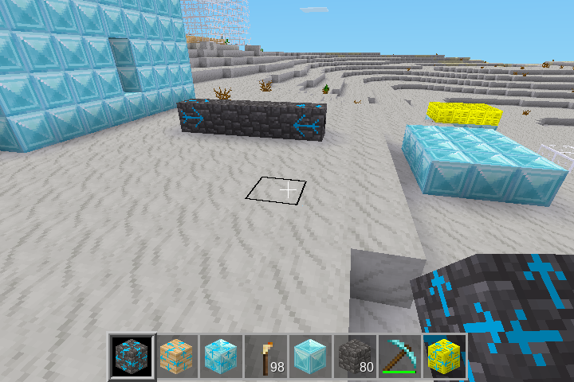

# Rectangle Builder Mod

This mod lets you build rectangles of certain blocks.
Currently supported blocks are 
"cobble", "glass", "pine_wood", "dirt", "mese", "diamondblock" and "silver_sand".

When not playing in creative mode, you have to have enough blocks in your inventory.

## Usage
Place a rectangle_builder block anywhere. Then place
a second such block in a straight axis at a distance of at most 30 blocks. The line between them must be completely free. Then the line will get filled with blocks and the two blocks at the end will indicate the direction in wich a rectangle might be filled.

Then place a third block in a straight axis from one of the two blocks (see screenshot above). The rectangle will be filled (except for places containing other stuff).

## Installation

Download the [zip-File](https://github.com/ivo-bloechliger/luanti_rectangle_builder/raw/refs/heads/main/rectangle_builder.zip).

Then follow the [official Instructions](https://wiki.minetest.net/Installing_Mods).

With Linux, copy the unzipped folder into 

     ~/.minetest/mods

or if you want it just for one specific world:

     ~/.minetest/worlds/NAME_OF_YOUR_WORLD/worldmods

